---
tags:
  - Argo CD
  - cert-manager
  - Cilium
  - ExternalDNS
  - Gateway API
  - Helm
  - Kubernetes
  - Kustomize
  - OpenTofu
  - Tailscale
  - Talos Linux
tocopen: true
title: Building a homelab (#2) - Setting up Argo CD
slug: building-a-homelab-2-setting-up-argo-cd
---

This is part of series *Building a homelab*, where I document my journey to build my own homelab with Kubernetes.

1. [Creating a Kubernetes cluster with Talos Linux](/blog/2026/02/building-a-homelab-1-creating-a-kubernetes-cluster-with-talos-linux/)
2. Setting up Argo CD

---

# Introduction

I have previously stated [at the end of my post about Talos Linux](/blog/2026/02/building-a-homelab-1-creating-a-kubernetes-cluster-with-talos-linux/#conclusion "Building a homelab (#1) - Creating a Kubernetes cluster with Talos Linux") that the next step was to migrate existing services to my Kubernetes cluster. I currently have two of them in operation, which are [Ente Photos](/blog/2025/09/hosting-ente-with-terraform-vault-and-nixos/ "Hosting Ente with Terraform, Vault, and NixOS") and [PeerTube](/blog/2025/03/self-hosting-peertube-with-tailscale/ "Self-hosting PeerTube with Tailscale").

With how (somewhat) effortless installing [Helm](https://helm.sh/ "Helm") charts with [Terraform](https://developer.hashicorp.com/terraform "Terraform | HashiCorp Developer")/[OpenTofu](https://opentofu.org/ "OpenTofu") was, I initially considered using the infrastructure-as-code tool to deploy just about everything. However, I then realised that:

- not everything is packaged as Helm charts
- applying some manifests with Terraform/OpenTofu can be problematic, especially if the resource in question is a [`CustomResourceDefinition`](https://kubernetes.io/docs/tasks/extend-kubernetes/custom-resources/custom-resource-definitions/ "Extend the Kubernetes API with CustomResourceDefinitions | Kubernetes") (CRD) object

The reason for the latter is that the [`kubernetes_manifest` resource](https://search.opentofu.org/provider/hashicorp/kubernetes/v3.0.1/docs/resources/manifest "Kubernetes: kubernetes_manifest - hashicorp/kubernetes - OpenTofu Registry") from the [Kubernetes provider](https://search.opentofu.org/provider/hashicorp/kubernetes/v3.0.1 "Provider: Kubernetes - hashicorp/kubernetes - OpenTofu Registry") requires the cluster to be already set up prior to planning.

> This resource requires API access during planning time. This means the cluster has to be accessible at plan time and thus cannot be created in the same apply operation. We recommend only using this resource for custom resources or resources not yet fully supported by the provider.
{cite="https://search.opentofu.org/provider/hashicorp/kubernetes/v3.0.1/docs/resources/manifest" caption="Kubernetes: kubernetes_manifest - hashicorp/kubernetes - OpenTofu Registry"}

With [Talos Linux](https://search.opentofu.org/provider/siderolabs/talos/v0.10.1 "Provider: Talos - siderolabs/talos - OpenTofu Registry") being set up during the application, it was not going to be the case. Since I was likely better off choosing a better fit for the Kubernetes ecosystem anyway, I decided to set up a well-known "continuous delivery tool for Kubernetes": [Argo CD](https://argoproj.github.io/cd/ "Argo CD | Argo").

# Maintaining the system

Before starting with the deployment, though, I had a few things to do to get the cluster ready.

## Hardware: the coin-cell battery

The laptop that is running the cluster has [its main battery disconnected](/blog/2025/11/building-a-project-2-preparing-a-server/#disconnecting-the-battery "Building a project (#2) - Preparing a server"), which was done to prevent wear.

Upon losing power, though, it was no longer able to retain modifications to firmware settings. It was a problem, as I had to [set "SATA Operation" to AHCI](https://www.dell.com/support/kbdoc/en-us/000123462/recommended-bios-settings-for-your-linux-system "Recommended BIOS Settings for your Linux System | Dell US") (from RAID), which would be reverted when a power interruption happens.

To prevent the system from losing its settings, I decided to replace its coin-cell battery. [The service manual](https://dl.dell.com/Manuals/all-products/esuprt_laptop/esuprt_xps_laptop/xps-13-9350-laptop_Service%20Manual_en-us.pdf) I have previously used for [disconnecting the display](/blog/2026/02/building-a-homelab-1-creating-a-kubernetes-cluster-with-talos-linux/#the-display-problem "Building a homelab (#1) - Creating a Kubernetes cluster with Talos Linux") was opened again as a reference.

First, I shut down the system using `talosctl`.

```bash-session
[lyuk98@framework:~]$ nix shell nixpkgs#talosctl

[lyuk98@framework:~]$ talosctl shutdown
```


  > First, I removed eight screws from the bottom of the laptop.
  >
  > 
  >
  > The flap in the middle was then opened, and a screw hidden underneath was removed.
  >
  > 
  {author="" cite="/blog/2025/11/building-a-project-2-preparing-a-server/#disconnecting-the-battery" caption="Building a project (#2) - Preparing a server"}


Once it was open, I could see the RTC battery sitting beside the primary battery pack.

<picture>
  <source srcset="https://images.lyuk98.com/c599441f-a760-4685-a604-25423695b5b6.avif" type="image/avif">
  
</picture>

It was an ML1220 rechargeable coin-cell battery. I peeled off what was wrapping up the cell and saw thin contacts seemingly soldered into the battery.

<picture>
  <source srcset="https://images.lyuk98.com/b4b7b4d0-45ec-406e-92f5-bbab660b98f3.avif" type="image/avif">
  
</picture>

A replacement battery was to be purchased. The problem, however, was that it would take at least a few weeks for proper battery replacements (with connectors to connect to the motherboard with) to be delivered. As a result, while waiting for one, I experimented with just the cell, which arrived just a day after making an order.

The old cell was then separated from the connector.

<picture>
  <source srcset="https://images.lyuk98.com/8923e578-b2be-4d3a-ade8-c825bb6a6692.avif" type="image/avif">
  
</picture>

I initially considered soldering the new one next, but later felt that it is not a good idea to expose a cell to a lot of heat. Because of that, it was just wrapped with some electrical tape while making contacts.

<picture>
  <source srcset="https://images.lyuk98.com/f1fa74ad-ccc8-4a38-84bb-eb85b5c12426.avif" type="image/avif">
  
</picture>

When the system was powered on, though, it disappointingly failed to start. Its diagnostic indicator, which blinked three times in amber and once in white, [indicated](https://www.dell.com/support/kbdoc/en-us/000141206/a-reference-guide-to-the-xps-notebook-diagnostic-indicators#2014_2025 "A Reference Guide to the XPS Laptop Diagnostic Indicators | Dell US") a "CMOS battery failure".

I later realised that connecting the main battery allows the system to be usable again. With a possibility that the previous coin-cell battery only needed to be charged (and not outright be replaced), I started thinking that all the steps I have taken so far may have been for nothing.

I know about that now, at least. With the device running even without the RTC battery, I decided to continue in this state.

## Software: upgrading Talos Linux and Kubernetes

Since when I deployed my cluster, newer versions of both [Talos Linux](https://github.com/siderolabs/talos/releases "Releases · siderolabs/talos") and [Kubernetes](https://kubernetes.io/releases/ "Releases | Kubernetes") were made available. Before making more modifications to the cluster, I decided to update the environment.

At the time I was working on this part, the newest version of Talos Linux was [v1.12.6](https://github.com/siderolabs/talos/releases/tag/v1.12.6 "Release v1.12.6 · siderolabs/talos"). As upgrading the cluster using Terraform/OpenTofu is [still not possible](https://github.com/siderolabs/terraform-provider-talos/issues/140 "gracefull upgrades through terraform · Issue #140 · siderolabs/terraform-provider-talos"), some manual steps were to be involved.

I first went to my repository for OpenTofu configurations. From there, I went through pretty much the same steps [as the last time](/blog/2026/02/building-a-homelab-1-creating-a-kubernetes-cluster-with-talos-linux/#running-opentofu "Building a homelab (#1) - Creating a Kubernetes cluster with Talos Linux").

> Before initialisation, I prepared environment variables for `tofu` to use.
>
> ```
> [lyuk98@framework:~/opentofu-kubernetes]$ nix-shell --pure
> [nix-shell:~/opentofu-kubernetes]$ source ~/env.sh
> ```
>
> The `env.sh` I wrote contained declarations of the following environment variables:
>
> - `AWS_SECRET_ACCESS_KEY`: the application key from Backblaze B2 to access the bucket with
> - `AWS_ACCESS_KEY_ID`: the ID of the abovementioned application key
> - `AWS_ENDPOINT_URL_S3`: Backblaze B2's S3 API endpoint
> - `CLOUDFLARE_API_TOKEN`: the API token for Cloudflare operations
> - `TAILSCALE_OAUTH_CLIENT_SECRET`: the OAuth credential used for deployment
> - `TAILSCALE_OAUTH_CLIENT_ID`: the ID of the abovementioned OAuth credential
>
> On top of the above, the file also had input variables set as environment variables:
>
> - `TF_VAR_state_passphrase`: the passphrase used for encrypting and decrypting state and plan data
> - `TF_VAR_cloudflare_zone_id`: Cloudflare zone ID
> - `TF_VAR_node_xps13`: address of the node; the only possible option, with the node in maintenance mode, was the internal IP address of my home network (such as `192.168.0.2`).
>
> I then prepared another file `backend.tfvars` with just one line of backend configuration: the bucket name.
>
> ```
> [nix-shell:~/opentofu-kubernetes]$ cat backend.tfvars
> bucket = "opentofu-state-kubernetes"
> ```
{author="" cite="/blog/2026/02/building-a-homelab-1-creating-a-kubernetes-cluster-with-talos-linux/#running-opentofu" caption="Building a homelab (#1) - Creating a Kubernetes cluster with Talos Linux"}

One thing I did differently this time was that I did not set `TF_VAR_node_xps13`. It [defaults to the hostname](https://github.com/lyuk98/opentofu-kubernetes/blob/471ab3b86f776f084fc1481ca4402a6f8cfcf40a/variables.tf#L29-L33 "opentofu-kubernetes/variables.tf at 471ab3b86f776f084fc1481ca4402a6f8cfcf40a · lyuk98/opentofu-kubernetes"), which Tailscale's [MagicDNS](https://tailscale.com/docs/features/magicdns "MagicDNS · Tailscale Docs") automatically resolves to the device's tailnet IP address.

I ran `tofu init`, while adding `-upgrade` to get latest versions of providers.

```bash-session
[nix-shell:~/opentofu-kubernetes]$ tofu init -backend-config=backend.tfvars -upgrade
```

Then, at [`variables.tf`](https://github.com/lyuk98/opentofu-kubernetes/blob/c3b637ab6c0224907274d09cea731fbd871ebd98/variables.tf "opentofu-kubernetes/variables.tf at c3b637ab6c0224907274d09cea731fbd871ebd98 · lyuk98/opentofu-kubernetes"), new versions were specified.

```diff
 variable "talos_version" {
   type        = string
   description = "Version of Talos Linux"
-  default     = "v1.12.4"
+  default     = "v1.12.6"
   nullable    = false
 }
 
 variable "kubernetes_version" {
   type        = string
   description = "Version of Kubernetes to use with Talos Linux"
-  default     = "v1.35.1"
+  default     = "v1.35.3"
   nullable    = false
 }
```

The changes were applied next, by running `tofu plan` and `tofu apply`.

```bash-session
[nix-shell:~/opentofu-kubernetes]$ tofu plan -out=tfplan

[nix-shell:~/opentofu-kubernetes]$ tofu apply tfplan
```

When it was done, I was surprised to see that Kubernetes was already updated. Talos Linux, on the other hand, was expectedly still in its previous version.

```bash-session
[lyuk98@framework:~]$ nix shell nixpkgs#kubectl nixpkgs#talosctl

[lyuk98@framework:~]$ kubectl version
Client Version: v1.35.3
Kustomize Version: v5.7.1
Server Version: v1.35.3

[lyuk98@framework:~]$ talosctl version
Client:
	Tag:         v1.12.6
	SHA:         undefined
	Built:       
	Go version:  go1.26.1
	OS/Arch:     linux/amd64
Server:
	NODE:        xps13
	Tag:         v1.12.4
	SHA:         fc8e600b
	Built:       
	Go version:  go1.25.7
	OS/Arch:     linux/amd64
	Enabled:     RBAC
```

Rebooting the node did not do anything, so I queried the OpenTofu state to see new [Image Factory](https://factory.talos.dev/ "Image Factory") URLs.

```bash-session
[nix-shell:~/opentofu-kubernetes]$ tofu state show data.talos_image_factory_urls.xps13
# data.talos_image_factory_urls.xps13:
data "talos_image_factory_urls" "xps13" {
    architecture  = "amd64"
    platform      = "metal"
    schematic_id  = "19bad511ec610d3ce5fe680fd34334e45621f0e90c7b2f621998647e7f5f5ef9"
    talos_version = "v1.12.6"
    urls          = {
        disk_image            = "https://factory.talos.dev/image/19bad511ec610d3ce5fe680fd34334e45621f0e90c7b2f621998647e7f5f5ef9/v1.12.6/metal-amd64.raw.zst"
        disk_image_secureboot = "https://factory.talos.dev/image/19bad511ec610d3ce5fe680fd34334e45621f0e90c7b2f621998647e7f5f5ef9/v1.12.6/metal-amd64-secureboot.raw.zst"
        initramfs             = "https://factory.talos.dev/image/19bad511ec610d3ce5fe680fd34334e45621f0e90c7b2f621998647e7f5f5ef9/v1.12.6/initramfs-amd64.xz"
        installer             = "factory.talos.dev/metal-installer/19bad511ec610d3ce5fe680fd34334e45621f0e90c7b2f621998647e7f5f5ef9:v1.12.6"
        installer_secureboot  = "factory.talos.dev/metal-installer-secureboot/19bad511ec610d3ce5fe680fd34334e45621f0e90c7b2f621998647e7f5f5ef9:v1.12.6"
        iso                   = "https://factory.talos.dev/image/19bad511ec610d3ce5fe680fd34334e45621f0e90c7b2f621998647e7f5f5ef9/v1.12.6/metal-amd64.iso"
        iso_secureboot        = "https://factory.talos.dev/image/19bad511ec610d3ce5fe680fd34334e45621f0e90c7b2f621998647e7f5f5ef9/v1.12.6/metal-amd64-secureboot.iso"
        kernel                = "https://factory.talos.dev/image/19bad511ec610d3ce5fe680fd34334e45621f0e90c7b2f621998647e7f5f5ef9/v1.12.6/kernel-amd64"
        kernel_command_line   = "https://factory.talos.dev/image/19bad511ec610d3ce5fe680fd34334e45621f0e90c7b2f621998647e7f5f5ef9/v1.12.6/cmdline-metal-amd64"
        pxe                   = "https://pxe.factory.talos.dev/pxe/19bad511ec610d3ce5fe680fd34334e45621f0e90c7b2f621998647e7f5f5ef9/v1.12.6/metal-amd64"
        uki                   = "https://factory.talos.dev/image/19bad511ec610d3ce5fe680fd34334e45621f0e90c7b2f621998647e7f5f5ef9/v1.12.6/metal-amd64-secureboot-uki.efi"
    }
}
```

The `installer_secureboot` was the one for me to use. With it, the upgrade was performed using `talosctl upgrade`.

```bash-session
[lyuk98@framework:~]$ talosctl upgrade \
  --image factory.talos.dev/metal-installer-secureboot/19bad511ec610d3ce5fe680fd34334e45621f0e90c7b2f621998647e7f5f5ef9:v1.12.6 \
  --nodes xps13 \
  --stage
```

After a long wait, the node was rebooted to finish the upgrade process.

```bash-session
[lyuk98@framework:~]$ talosctl reboot
```

With the cluster now up to date, I moved on to actual deployments.

```bash-session
[lyuk98@framework:~]$ talosctl version
Client:
	Tag:         v1.12.6
	SHA:         undefined
	Built:       
	Go version:  go1.26.1
	OS/Arch:     linux/amd64
Server:
	NODE:        xps13
	Tag:         v1.12.6
	SHA:         a1b8bd61
	Built:       
	Go version:  go1.25.8
	OS/Arch:     linux/amd64
	Enabled:     RBAC
```

# The plan

## Tailscale network with support for custom domains and HTTPS

I wanted to make Argo CD accessible by web browsers, while blocking access from the rest of the internet by exposing it only over the tailnet. Tailscale allows users [to do just that](https://tailscale.com/docs/features/kubernetes-operator/how-to/cluster-ingress "Expose a Kubernetes cluster workload to your tailnet (cluster ingress) · Tailscale Docs"), where the easiest solution was [to annotate an existing `Service`](https://tailscale.com/docs/features/kubernetes-operator/how-to/cluster-ingress#exposing-a-cluster-workload-by-annotating-an-existing-service "Expose a Kubernetes cluster workload to your tailnet (cluster ingress) · Tailscale Docs"). It could have almost worked for me, but I ~~unfortunately~~ wanted one more thing: using a custom domain to access the service.

I initially tried to solve this in three steps:

1. Deploy Helm chart for Argo CD with aforementioned annotation trick
2. Wait for the service to appear in the tailnet
3. Let OpenTofu create DNS records with the service's tailnet IP addresses

However, this meant that I will have to access the service via plain HTTP, like [what I am currently doing with Vault](/blog/2025/09/hosting-ente-with-terraform-vault-and-nixos/#vault "Hosting Ente with Terraform, Vault, and NixOS"). Although I am aware that network traffic between Tailscale nodes are encrypted, I thought it would be a plus to make web browsers stop complaining about insecure connections. As a result, I decided to manually expose the service, while additionally deploying [cert-manager](https://cert-manager.io/ "cert-manager") to issue HTTPS certificates.

## In favour of Gateway API

A common way to expose a [`Service`](https://kubernetes.io/docs/concepts/services-networking/service/ "Service | Kubernetes") to an external network seemed to be using [`Ingress`](https://kubernetes.io/docs/concepts/services-networking/ingress/ "Ingress | Kubernetes"). However, I noticed that Kubernetes no longer recommends its use.

> The Kubernetes project recommends using [Gateway](https://gateway-api.sigs.k8s.io/) instead of [Ingress](https://kubernetes.io/docs/concepts/services-networking/ingress/). The Ingress API has been frozen.
>
> This means that:
>
> - The Ingress API is generally available, and is subject to the [stability guarantees](https://kubernetes.io/docs/reference/using-api/deprecation-policy/#deprecating-parts-of-the-api) for generally available APIs. The Kubernetes project has no plans to remove Ingress from Kubernetes.
> - The Ingress API is no longer being developed, and will have no further changes or updates made to it.
{cite="https://kubernetes.io/docs/concepts/services-networking/ingress/" caption="Ingress | Kubernetes"}

With [Ingress Nginx](https://kubernetes.github.io/ingress-nginx/ "Welcome - Ingress-Nginx Controller") already retired, and [its repository](https://github.com/kubernetes/ingress-nginx "kubernetes/ingress-nginx: Ingress NGINX Controller for Kubernetes") archived, I did not want my cluster to have a known dependency to a retiring technology right from the beginning. Despite the relative lack of documentation, I decided to adopt [Gateway API](https://gateway-api.sigs.k8s.io/ "Introduction - Kubernetes Gateway API"), choosing [Cilium](https://cilium.io/ "Cilium - Cloud Native, eBPF-based Networking, Observability, and Security") as its implementation (because it is already present in the cluster).

## Managing DNS records from Kubernetes

While searching for resources on using Gateway API, I found [a documentation from Tailscale](https://tailscale.com/docs/solutions/kubernetes-operator-byod-gateway-api "Use custom domains with Kubernetes Gateway API and Tailscale · Tailscale Docs") that does almost exactly what I wanted. A difference, though, was that I intended to use Cilium instead of [Envoy](https://www.envoyproxy.io/ "Envoy proxy - home") as the Gateway API implementation (although I believe the former does use the latter in some capacity).

The aforementioned documentation also mentioned [ExternalDNS](https://kubernetes-sigs.github.io/external-dns/latest/ "external-dns"), which would automatically create DNS records. I felt it was much more reliable than letting OpenTofu do so, eventually also deciding to deploy this service as a result.

## Using Argo CD to deploy Argo CD (in some way)

At first, I very much wanted to deploy everything as Helm charts, due to their seemingly less maintenance burden. Some resources (like [`ClusterIssuer`](https://cert-manager.io/docs/concepts/issuer/ "Issuer - cert-manager Documentation")), however, were not automatically created by them. Even worse, using Helm to deploy those additional resources, such as by setting the chart's [`extraObjects`](https://artifacthub.io/packages/helm/cert-manager/cert-manager#:~:text=extraObjects) value for cert-manager, was not very reliable; in some cases, user-specified manifests were attempted to be installed before CRDs for them were even available.

Eventually, I planned to create Argo CD's [`Application`](https://argo-cd.readthedocs.io/en/release-3.3/core_concepts/ "Core Concepts - Argo CD - Declarative GitOps CD for Kubernetes") resources that are synchronised with a repository that contains additional manifests. To deploy them before the service is properly set up, I chose [argocd-apps](https://github.com/argoproj/argo-helm/tree/argo-cd-9.5.0/charts/argocd-apps "argo-helm/charts/argocd-apps at main · argoproj/argo-helm") from a collection of community-maintained Argo Helm charts.

Charts for services themselves (including Cilium, Tailscale Kubernetes Operator, cert-manager, ExternalDNS, and Argo CD) were to be installed in the same way as before, using the [`helm_release`](https://search.opentofu.org/provider/hashicorp/helm/v3.1.1/docs/resources/release "helm: helm_release - hashicorp/helm - OpenTofu Registry") resource. For other resources, a set of `Application` objects was to handle their deployments.

## Talos Linux + Cilium + Tailscale + Gateway API + cert-manager + ExternalDNS

At this point, I have not seen anyone attempt to deploy Argo CD with this combination of services. I was somewhat excited to be one of the few (if not the only one) to document doing so, but at the same time, it meant that resources I find online have to be modified to fit my needs. It is not like I am usually complacent with solutions I think could be improved, though.

~~It was not supposed to be this complicated...~~

# Writing configurations

## A little bit of refactoring

I started by moving all `provider` declarations, like the following block for Helm, to [`main.tf`](https://github.com/lyuk98/opentofu-kubernetes/blob/fce616b2abe59bc2b29f3ef3fc9559b1ea7fa686/main.tf "opentofu-kubernetes/main.tf at fce616b2abe59bc2b29f3ef3fc9559b1ea7fa686 · lyuk98/opentofu-kubernetes").

```tf
# Helm package manager
provider "helm" {
  kubernetes = {
    host = local.cluster_endpoint

    client_certificate     = base64decode(talos_cluster_kubeconfig.kubernetes.kubernetes_client_configuration.client_certificate)
    client_key             = base64decode(talos_cluster_kubeconfig.kubernetes.kubernetes_client_configuration.client_key)
    cluster_ca_certificate = base64decode(talos_cluster_kubeconfig.kubernetes.kubernetes_client_configuration.ca_certificate)
  }
}
```

Versions for Helm charts were then specified [as variables](https://github.com/lyuk98/opentofu-kubernetes/blob/fce616b2abe59bc2b29f3ef3fc9559b1ea7fa686/variables.tf "opentofu-kubernetes/variables.tf at fce616b2abe59bc2b29f3ef3fc9559b1ea7fa686 · lyuk98/opentofu-kubernetes"), which would help make changes to them without editing the code.

```tf
variable "cilium_version" {
  type        = string
  description = "Version of the Helm chart for Cilium"
  default     = "1.19.2"
  nullable    = false
}

variable "tailscale_operator_version" {
  type        = string
  description = "Version of the Helm chart for Tailscale Operator"
  default     = "1.96.5"
  nullable    = false
}
```

`helm.tf` was deleted and charts declared there were moved. `helm_release.cilium` was moved to [`cilium.tf`](https://github.com/lyuk98/opentofu-kubernetes/blob/fce616b2abe59bc2b29f3ef3fc9559b1ea7fa686/cilium.tf "opentofu-kubernetes/cilium.tf at fce616b2abe59bc2b29f3ef3fc9559b1ea7fa686 · lyuk98/opentofu-kubernetes"), and `helm_release.tailscale_operator` was moved to [`tailscale.tf`](https://github.com/lyuk98/opentofu-kubernetes/blob/fce616b2abe59bc2b29f3ef3fc9559b1ea7fa686/tailscale.tf "opentofu-kubernetes/tailscale.tf at fce616b2abe59bc2b29f3ef3fc9559b1ea7fa686 · lyuk98/opentofu-kubernetes").

Node-specific Tailscale resources were then moved to [`talos-xps13.tf`](https://github.com/lyuk98/opentofu-kubernetes/blob/fce616b2abe59bc2b29f3ef3fc9559b1ea7fa686/talos-xps13.tf "opentofu-kubernetes/talos-xps13.tf at fce616b2abe59bc2b29f3ef3fc9559b1ea7fa686 · lyuk98/opentofu-kubernetes").

```tf
# OAuth client for node (XPS 13)
resource "tailscale_oauth_client" "xps13" {
  scopes      = ["auth_keys"]
  description = local.hostnames.control_plane.xps13
  tags        = ["tag:k8s-control-plane", "tag:k8s-worker"]
}

# Tailnet device information (XPS 13)
data "tailscale_device" "xps13" {
  depends_on = [talos_machine_configuration_apply.xps13]
  hostname   = local.hostnames.control_plane.xps13
  wait_for   = "10m"
}
```

Lastly, [`Namespace`](https://kubernetes.io/docs/concepts/overview/working-with-objects/namespaces/ "Namespaces | Kubernetes") for Tailscale was set to be managed by OpenTofu, instead of being created upon the Helm chart's installation.

```tf
# Kubernetes Namespace (Tailscale)
resource "kubernetes_namespace_v1" "tailscale" {
  metadata {
    name = "tailscale"
    labels = {
      # Enforce "privileged" Pod Security Standards policy
      "pod-security.kubernetes.io/enforce" = "privileged"
    }
  }
}
```

The [Pod Security Standards](https://kubernetes.io/docs/concepts/security/pod-security-standards/ "Pod Security Standards | Kubernetes") policy for resources in this `Namespace` was set to *Privileged*, as it is apparently required to avoid [problems](https://github.com/tailscale/tailscale/issues/11143 "Kubernetes load balancer services stay pending · Issue #11143 · tailscale/tailscale") in setting up Tailscale's [load balancer](https://kubernetes.io/docs/tasks/access-application-cluster/create-external-load-balancer/ "Create an External Load Balancer | Kubernetes") that will be used for Gateway API configuration later.

## Gateway API

As [mentioned earlier](#in-favour-of-gateway-api "Building a homelab (#2) - Setting up Argo CD"), Cilium was my choice of Gateway API implementation. [Their documentation](https://docs.cilium.io/en/v1.19/network/servicemesh/gateway-api/gateway-api/ "Gateway API Support — Cilium 1.19.3 documentation") listed a few prerequisites for enabling the feature, which I followed next.

### The kube-proxy replacement

> - Cilium must be configured with the kube-proxy replacement, using `kubeProxyReplacement=true`. For more information, see [kube-proxy replacement](https://docs.cilium.io/en/v1.19/network/kubernetes/kubeproxy-free/#kubeproxy-free).

Adding [one additional object](https://github.com/lyuk98/opentofu-kubernetes/blob/fce616b2abe59bc2b29f3ef3fc9559b1ea7fa686/cilium.tf#L91-L95 "opentofu-kubernetes/cilium.tf at fce616b2abe59bc2b29f3ef3fc9559b1ea7fa686 · lyuk98/opentofu-kubernetes") to [`set`](https://search.opentofu.org/provider/hashicorp/helm/v3.1.1/docs/resources/release#schema "helm: helm_release - hashicorp/helm - OpenTofu Registry") was apparently enough.

```tf
# Helm chart (Cilium)
resource "helm_release" "cilium" {
  # ...

  set = [
    # ...
    # Configure the kube-proxy replacement
    {
      name  = "kubeProxyReplacement"
      value = true
    },
    # ...
  ]

  # ...
}
```

However, I then remembered that Talos Linux had [an option to disable kube-proxy](https://docs.siderolabs.com/talos/v1.12/reference/configuration/v1alpha1/config#proxy "MachineConfig - Sidero Documentation"), which I [added next](https://github.com/lyuk98/opentofu-kubernetes/blob/fce616b2abe59bc2b29f3ef3fc9559b1ea7fa686/talos-controlplane.tf#L31-L38 "opentofu-kubernetes/talos-controlplane.tf at fce616b2abe59bc2b29f3ef3fc9559b1ea7fa686 · lyuk98/opentofu-kubernetes").

```tf
locals {
  # Patches for control plane nodes
  talos_patches_controlplane = {
    # ...

    # Disable kube-proxy
    disable_proxy = {
      cluster = {
        proxy = {
          disabled = true
        }
      }
    }

    # ...
  }
}
```

### Gateway API CRDs

> - The below CRDs from Gateway API v1.4.1 `must` be pre-installed. Please refer to this [docs](https://gateway-api.sigs.k8s.io/guides/?h=crds#getting-started-with-gateway-api) for installation steps. Alternatively, the below snippet could be used.
>   - [GatewayClass](https://gateway-api.sigs.k8s.io/api-types/gatewayclass/)
>   - [Gateway](https://gateway-api.sigs.k8s.io/api-types/gateway/)
>   - [HTTPRoute](https://gateway-api.sigs.k8s.io/api-types/httproute/)
>   - [GRPCRoute](https://gateway-api.sigs.k8s.io/api-types/grpcroute/)
>   - [ReferenceGrant](https://gateway-api.sigs.k8s.io/api-types/referencegrant/)

From what I understood, this meant that the CRDs must exist before Cilium; I had to find a way to somehow install them with OpenTofu.

Although I could not find an official Helm chart for the resources, their repository had [a `Kustomization` resource](https://github.com/kubernetes-sigs/gateway-api/blob/v1.4.1/config/crd/kustomization.yaml "gateway-api/config/crd/kustomization.yaml at v1.4.1 · kubernetes-sigs/gateway-api"), which could be used to install them with [the Kustomize provider](https://search.opentofu.org/provider/kbst/kustomization/v0.9.7 "index - kbst/kustomization - OpenTofu Registry").

I first [added a variable](https://github.com/lyuk98/opentofu-kubernetes/blob/fce616b2abe59bc2b29f3ef3fc9559b1ea7fa686/variables.tf#L84-L89 "opentofu-kubernetes/variables.tf at fce616b2abe59bc2b29f3ef3fc9559b1ea7fa686 · lyuk98/opentofu-kubernetes") to declare the version of Gateway API CRDs to use. The latest version at the time of writing is [v1.5.1](https://github.com/kubernetes-sigs/gateway-api/releases/tag/v1.5.1 "Release v1.5.1 · kubernetes-sigs/gateway-api"), but given that Cilium specifically requires [v1.4.1](https://github.com/kubernetes-sigs/gateway-api/releases/tag/v1.4.1 "Release v1.4.1 · kubernetes-sigs/gateway-api") and that v1.5 does not properly work with the implementation, I could not choose the newer version.

```tf
variable "gateway_api_version" {
  type        = string
  description = "Version of Gateway API CRDs"
  default     = "v1.4.1"
  nullable    = false
}
```

(It was a pain to roll back from v1.5 to v1.4, as a [validating admission policy](https://kubernetes.io/docs/reference/access-authn-authz/validating-admission-policy/ "Validating Admission Policy | Kubernetes") was introduced in the newer version to prevent downgrades.)

The provider was then set up by [adding it to the `required_providers` block](https://github.com/lyuk98/opentofu-kubernetes/blob/fce616b2abe59bc2b29f3ef3fc9559b1ea7fa686/main.tf#L55-L58 "opentofu-kubernetes/main.tf at fce616b2abe59bc2b29f3ef3fc9559b1ea7fa686 · lyuk98/opentofu-kubernetes") and [declaring a `provider` block](https://github.com/lyuk98/opentofu-kubernetes/blob/fce616b2abe59bc2b29f3ef3fc9559b1ea7fa686/main.tf#L107-L110 "opentofu-kubernetes/main.tf at fce616b2abe59bc2b29f3ef3fc9559b1ea7fa686 · lyuk98/opentofu-kubernetes").

```tf
terraform {
  # ...

  required_providers {
    # ...
    kustomization = {
      source  = "kbst/kustomization"
      version = "~> 0.9.7"
    }
    # ...
  }
}

# ...

# Kustomization provider
provider "kustomization" {
  kubeconfig_raw = talos_cluster_kubeconfig.kubernetes.kubeconfig_raw
}

# ...
```

Then, using the [`kustomization_build`](https://search.opentofu.org/provider/kbst/kustomization/v0.9.7/docs/datasources/build "build - kbst/kustomization - OpenTofu Registry") data source, manifests for the [`kustomization_resource`](https://search.opentofu.org/provider/kbst/kustomization/v0.9.7/docs/resources/resource "resource - kbst/kustomization - OpenTofu Registry") resource to apply to the cluster [were set to be generated](https://github.com/lyuk98/opentofu-kubernetes/blob/fce616b2abe59bc2b29f3ef3fc9559b1ea7fa686/cilium.tf#L1-L4 "opentofu-kubernetes/cilium.tf at fce616b2abe59bc2b29f3ef3fc9559b1ea7fa686 · lyuk98/opentofu-kubernetes").

```tf
# Kustomization - Gateway API CRDs
data "kustomization_build" "gateway_api" {
  path = "github.com/kubernetes-sigs/gateway-api/config/crd?ref=${urlencode(var.gateway_api_version)}"
}
```

It would download the `Kustomization` resource over Git and build the manifest. Because this operation needs Git itself as well as public Certificate Authorities (CA) to communicate over HTTPS, corresponding packages [were added](https://github.com/lyuk98/opentofu-kubernetes/blob/fce616b2abe59bc2b29f3ef3fc9559b1ea7fa686/default.nix#L9-L10 "opentofu-kubernetes/default.nix at fce616b2abe59bc2b29f3ef3fc9559b1ea7fa686 · lyuk98/opentofu-kubernetes") to `default.nix` for the `nix-shell` environment.

```nix
{
  pkgs ? import <nixpkgs> { },
  ...
}:
{
  # The default development environment
  default = pkgs.mkShellNoCC {
    nativeBuildInputs = with pkgs; [
      cacert # for fetching from Git over HTTPS
      git
      opentofu
      python3
    ];
  };
}
```

The manifests were then set to be applied to the cluster. Because some resources apparently need to be applied before the others, I followed [the provider's example](https://search.opentofu.org/provider/kbst/kustomization/v0.9.7/docs/resources/resource#provider-example "resource - kbst/kustomization - OpenTofu Registry") to apply them sequentially based on their priorities.

```tf
# Gateway API CRDs - priority 0
resource "kustomization_resource" "gateway_api_p0" {
  for_each = data.kustomization_build.gateway_api.ids_prio[0]
  manifest = data.kustomization_build.gateway_api.manifests[each.value]
}
# Gateway API CRDs - priority 1
resource "kustomization_resource" "gateway_api_p1" {
  depends_on = [kustomization_resource.gateway_api_p0]
  for_each   = data.kustomization_build.gateway_api.ids_prio[1]
  manifest   = data.kustomization_build.gateway_api.manifests[each.value]
}
# Gateway API CRDs - priority 2
resource "kustomization_resource" "gateway_api_p2" {
  depends_on = [kustomization_resource.gateway_api_p1]
  for_each   = data.kustomization_build.gateway_api.ids_prio[2]
  manifest   = data.kustomization_build.gateway_api.manifests[each.value]
}
```

### Modifying Cilium

After the prerequisites were dealt with, the chart resource for Cilium [was edited](https://github.com/lyuk98/opentofu-kubernetes/blob/fce616b2abe59bc2b29f3ef3fc9559b1ea7fa686/cilium.tf#L26 "opentofu-kubernetes/cilium.tf at fce616b2abe59bc2b29f3ef3fc9559b1ea7fa686 · lyuk98/opentofu-kubernetes") to `depends_on` the Gateway API resources. Some additional values [were specified](https://github.com/lyuk98/opentofu-kubernetes/blob/fce616b2abe59bc2b29f3ef3fc9559b1ea7fa686/cilium.tf#L96-L110 "opentofu-kubernetes/cilium.tf at fce616b2abe59bc2b29f3ef3fc9559b1ea7fa686 · lyuk98/opentofu-kubernetes") as well, which include Envoy-related configurations that I would later need for using Tailscale's load balancer.

```tf
# Helm chart (Cilium)
resource "helm_release" "cilium" {
  depends_on = [kustomization_resource.gateway_api_p2]

  chart      = "cilium"
  name       = "cilium"
  repository = "https://helm.cilium.io/"

  atomic          = true
  cleanup_on_fail = true
  namespace       = "kube-system"

  upgrade_install = true
  version         = var.cilium_version

  set = [
    # ...
    # Enable Cilium's Gateway API implementation
    {
      name  = "gatewayAPI.enabled"
      value = true
    },
    # Enable dedicated Envoy proxy DaemonSet
    {
      name  = "envoy.enabled"
      value = true
    },
    # Enable CiliumEnvoyConfig CRD
    {
      name  = "envoyConfig.enabled"
      value = true
    }
  ]

  # ...
}
```

## cert-manager and ExternalDNS

### Creating `Namespace`

First, new `Namespace` objects were set to be created by OpenTofu.

```tf
# Kubernetes Namespace (cert-manager)
resource "kubernetes_namespace_v1" "cert_manager" {
  metadata {
    name = "cert-manager"
  }
}

# Kubernetes Namespace (ExternalDNS)
resource "kubernetes_namespace_v1" "external_dns" {
  metadata {
    name = "external-dns"
  }
}
```

### Creating `Secret`

The [`Secret`](https://kubernetes.io/docs/concepts/configuration/secret/ "Secrets | Kubernetes") resources containing the Cloudflare API token, for cert-manager to [perform DNS-01 challenges](https://cert-manager.io/docs/configuration/acme/dns01/cloudflare/ "Cloudflare - cert-manager Documentation") (because HTTP-01 challenges are not possible for services over the tailnet) and for ExternalDNS to modify DNS records, were next. I could not figure out how either cert-manager or ExternalDNS can refer to a `Secret` from a different `Namespace`, so I used a [`for_each` argument](https://opentofu.org/docs/language/meta-arguments/for_each/ "The for_each Meta-Argument | OpenTofu") for the resource [to be applied](https://github.com/lyuk98/opentofu-kubernetes/blob/fce616b2abe59bc2b29f3ef3fc9559b1ea7fa686/external-dns.tf#L8-L29 "opentofu-kubernetes/external-dns.tf at fce616b2abe59bc2b29f3ef3fc9559b1ea7fa686 · lyuk98/opentofu-kubernetes") in two separate places.

```tf
# Secret containing Cloudflare API Token
resource "kubernetes_secret_v1" "cloudflare_api_token" {
  depends_on = [
    kubernetes_namespace_v1.cert_manager,
    kubernetes_namespace_v1.external_dns
  ]

  # Deploy to each Namespace
  for_each = toset(["cert-manager", "external-dns"])

  metadata {
    name      = "cloudflare-api-token"
    namespace = each.value
  }

  immutable = true
  type      = "Opaque"

  data = {
    api-token = var.cloudflare_api_token
  }
}
```

I decided to store [the same Cloudflare API token](/blog/2026/02/building-a-homelab-1-creating-a-kubernetes-cluster-with-talos-linux/#preparing-cloudflare) that OpenTofu itself uses, because [creating one](https://search.opentofu.org/provider/cloudflare/cloudflare/v5.18.0/docs/resources/api_token) from the infrastructure-as-code tool seemed a bit complicated. [A new variable](https://github.com/lyuk98/opentofu-kubernetes/blob/fce616b2abe59bc2b29f3ef3fc9559b1ea7fa686/variables.tf#L21-L26 "opentofu-kubernetes/variables.tf at fce616b2abe59bc2b29f3ef3fc9559b1ea7fa686 · lyuk98/opentofu-kubernetes") to accept the existing token was first created.

```tf
variable "cloudflare_api_token" {
  type        = string
  description = "API token for Cloudflare operations"
  sensitive   = true
  nullable    = false
}
```

The Cloudflare provider [was then configured](https://github.com/lyuk98/opentofu-kubernetes/blob/fce616b2abe59bc2b29f3ef3fc9559b1ea7fa686/main.tf#L82-L85 "opentofu-kubernetes/main.tf at fce616b2abe59bc2b29f3ef3fc9559b1ea7fa686 · lyuk98/opentofu-kubernetes") to use the variable for its API token instead.

```tf
# Cloudflare resource management
provider "cloudflare" {
  api_token = var.cloudflare_api_token
}
```

### Installing Helm charts

Like before, versions of services' charts were declared as variables.

```tf
variable "cert_manager_version" {
  type        = string
  description = "Version of the Helm chart for cert-manager"
  default     = "1.20.2"
  nullable    = false
}

variable "external_dns_version" {
  type        = string
  description = "Version of the Helm chart for ExternalDNS"
  default     = "1.20.0"
  nullable    = false
}
```

The chart for cert-manager was first [set to be installed](https://github.com/lyuk98/opentofu-kubernetes/blob/fce616b2abe59bc2b29f3ef3fc9559b1ea7fa686/cert-manager.tf#L19-L47 "opentofu-kubernetes/cert-manager.tf at fce616b2abe59bc2b29f3ef3fc9559b1ea7fa686 · lyuk98/opentofu-kubernetes").

```tf
# Helm chart (cert-manager)
resource "helm_release" "cert_manager" {
  depends_on = [
    kubernetes_namespace_v1.cert_manager,
    helm_release.cilium
  ]

  chart      = "cert-manager"
  name       = "cert-manager"
  repository = "https://charts.jetstack.io/"

  atomic          = true
  cleanup_on_fail = true
  namespace       = "cert-manager"

  upgrade_install = true
  version         = var.cert_manager_version

  values = [
    yamlencode({
      crds = {
        enabled = true
      }
      config = {
        enableGatewayAPI = true
      }
    })
  ]
}
```

The [chart for ExternalDNS](https://github.com/lyuk98/opentofu-kubernetes/blob/fce616b2abe59bc2b29f3ef3fc9559b1ea7fa686/external-dns.tf#L31-L88 "opentofu-kubernetes/external-dns.tf at fce616b2abe59bc2b29f3ef3fc9559b1ea7fa686 · lyuk98/opentofu-kubernetes") was next. Some supplied `values` indicated:

- [Cloudflare is to be used](https://github.com/lyuk98/opentofu-kubernetes/blob/fce616b2abe59bc2b29f3ef3fc9559b1ea7fa686/external-dns.tf#L51-L54 "opentofu-kubernetes/external-dns.tf at fce616b2abe59bc2b29f3ef3fc9559b1ea7fa686 · lyuk98/opentofu-kubernetes") as the DNS provider
- the API token is going to be provided by [the previously defined `Secret`](https://github.com/lyuk98/opentofu-kubernetes/blob/fce616b2abe59bc2b29f3ef3fc9559b1ea7fa686/external-dns.tf#L57-L66 "opentofu-kubernetes/external-dns.tf at fce616b2abe59bc2b29f3ef3fc9559b1ea7fa686 · lyuk98/opentofu-kubernetes")
- ExternalDNS [will only affect](https://github.com/lyuk98/opentofu-kubernetes/blob/fce616b2abe59bc2b29f3ef3fc9559b1ea7fa686/external-dns.tf#L69-L72 "opentofu-kubernetes/external-dns.tf at fce616b2abe59bc2b29f3ef3fc9559b1ea7fa686 · lyuk98/opentofu-kubernetes") my domain's records
- only the resources that set the label `external-dns: enabled` [will be set up](https://github.com/lyuk98/opentofu-kubernetes/blob/fce616b2abe59bc2b29f3ef3fc9559b1ea7fa686/external-dns.tf#L74-L75 "opentofu-kubernetes/external-dns.tf at fce616b2abe59bc2b29f3ef3fc9559b1ea7fa686 · lyuk98/opentofu-kubernetes")
- on top of the defaults (`Service` and `Ingress`), ExternalDNS [will also watch](https://github.com/lyuk98/opentofu-kubernetes/blob/fce616b2abe59bc2b29f3ef3fc9559b1ea7fa686/external-dns.tf#L77-L83 "opentofu-kubernetes/external-dns.tf at fce616b2abe59bc2b29f3ef3fc9559b1ea7fa686 · lyuk98/opentofu-kubernetes") `HTTPRoute` and `GRPCRoute` resources from Gateway API

```tf
# Helm chart (ExternalDNS)
resource "helm_release" "external_dns" {
  depends_on = [
    kubernetes_secret_v1.cloudflare_api_token["external-dns"],
    helm_release.cilium
  ]

  chart      = "external-dns"
  name       = "external-dns"
  repository = "https://kubernetes-sigs.github.io/external-dns/"

  atomic          = true
  cleanup_on_fail = true
  namespace       = "external-dns"

  upgrade_install = true
  version         = var.external_dns_version

  values = [
    yamlencode({
      provider = {
        # Use Cloudflare as the DNS provider
        name = "cloudflare"
      }

      env = [
        # Cloudflare API token
        {
          name = "CF_API_TOKEN"
          valueFrom = {
            secretKeyRef = {
              name = "cloudflare-api-token"
              key  = "api-token"
            }
          }
        }
      ]

      # Limit target zone to personal domain
      domainFilters = [
        data.cloudflare_zone.default.name
      ]

      # Only watch resources with the following label
      labelFilter = "external-dns==enabled"

      # Query Gateway API resources for endpoints
      sources = [
        "service",
        "ingress",
        "gateway-httproute",
        "gateway-grpcroute"
      ]
    })
  ]

  timeout = 600
}
```

## Argo CD

### Setting up the chart

A [variable](https://github.com/lyuk98/opentofu-kubernetes/blob/fce616b2abe59bc2b29f3ef3fc9559b1ea7fa686/variables.tf#L49-L54 "opentofu-kubernetes/variables.tf at fce616b2abe59bc2b29f3ef3fc9559b1ea7fa686 · lyuk98/opentofu-kubernetes"), a [`Namespace`](https://github.com/lyuk98/opentofu-kubernetes/blob/fce616b2abe59bc2b29f3ef3fc9559b1ea7fa686/argocd.tf#L23-L28 "opentofu-kubernetes/argocd.tf at fce616b2abe59bc2b29f3ef3fc9559b1ea7fa686 · lyuk98/opentofu-kubernetes"), and a [chart](https://github.com/lyuk98/opentofu-kubernetes/blob/fce616b2abe59bc2b29f3ef3fc9559b1ea7fa686/argocd.tf#L30-L62 "opentofu-kubernetes/argocd.tf at fce616b2abe59bc2b29f3ef3fc9559b1ea7fa686 · lyuk98/opentofu-kubernetes") were defined first.

```tf
variable "argocd_version" {
  type        = string
  description = "Version of the Helm chart for Argo CD"
  default     = "9.5.0"
  nullable    = false
}

# Kubernetes Namespace (Argo CD)
resource "kubernetes_namespace_v1" "argocd" {
  metadata {
    name = "argocd"
  }
}

# Helm chart (Argo CD)
resource "helm_release" "argocd" {
  depends_on = [
    kubernetes_namespace_v1.argocd,
    helm_release.cilium
  ]

  chart      = "argo-cd"
  name       = "argo-cd"
  repository = "https://argoproj.github.io/argo-helm"

  atomic          = true
  cleanup_on_fail = true
  namespace       = "argocd"

  upgrade_install = true
  version         = var.argocd_version

  values = [
    yamlencode({
      # Set domain for all components
      global = {
        domain = "argo-cd.tailnet.${data.cloudflare_zone.default.name}"
      }
      configs = {
        params = {
          # Run API server with TLS disabled for SSL termination
          "server.insecure" = true
        }
      }
    })
  ]
}
```

Since my main objective was to encrypt the traffic between the user and the cluster (and not the one within), [TLS termination](https://en.wikipedia.org/wiki/TLS_termination_proxy "TLS termination proxy - Wikipedia") was to be set up. As such, Argo CD's API server had its own TLS settings disabled.

{{< figure
  src="https://upload.wikimedia.org/wikipedia/commons/3/34/SSL_termination_proxy.svg"
  alt="The SSL termination proxy decrypts incoming HTTPS traffic and forwards it to a webservice."
  link="https://commons.wikimedia.org/wiki/File:SSL_termination_proxy.svg"
  attr="[File:SSL termination proxy.svg](https://commons.wikimedia.org/wiki/File:SSL_termination_proxy.svg) by [User:Galgalesh](https://commons.wikimedia.org/w/index.php?title=User:Galgalesh) is licensed under [CC BY-SA 4.0](https://creativecommons.org/licenses/by-sa/4.0/deed.en)"
>}}

### New repository and `Kustomization`

I created [a new repository at GitHub](https://github.com/lyuk98/argocd-kubernetes "lyuk98/argocd-kubernetes: Argo CD Application (Kubernetes)") to separately store manifests. From there, I wrote three `Kustomization` resources with the following directory structure:

```bash-session
[lyuk98@framework:~]$ nix shell nixpkgs#tree

[lyuk98@framework:~]$ tree ~/argocd-kubernetes/
/home/lyuk98/argocd-kubernetes/
├── argocd
│   ├── argocd-grpc-route.yaml
│   ├── argocd-http-route.yaml
│   └── kustomization.yaml
├── cert-manager
│   ├── kustomization.yaml
│   ├── letsencrypt-staging.yaml
│   └── letsencrypt.yaml
├── README.md
└── tailscale
    ├── gateway-class-tailscale.yaml
    ├── gateway-config-tailscale.yaml
    ├── gateway-tailscale.yaml
    └── kustomization.yaml

4 directories, 11 files
```

The reason why I did not implement the [app of apps pattern](https://argo-cd.readthedocs.io/en/release-3.3/operator-manual/cluster-bootstrapping/#app-of-apps-pattern "Cluster Bootstrapping - Argo CD - Declarative GitOps CD for Kubernetes") is because I wanted to keep `Application` resources within the OpenTofu configuration; it felt like the easiest way [to patch `Kustomization` resources](https://argo-cd.readthedocs.io/en/release-3.3/user-guide/kustomize/#patches "Kustomize - Argo CD - Declarative GitOps CD for Kubernetes") with sensitive infrastructure details.

#### `Kustomization`: cert-manager

Pretty much the only significant thing [`kustomization.yaml`](https://github.com/lyuk98/argocd-kubernetes/blob/8116239483ee68c4310e270478cb0d8d1f6682fb/cert-manager/kustomization.yaml "argocd-kubernetes/cert-manager/kustomization.yaml at 8116239483ee68c4310e270478cb0d8d1f6682fb · lyuk98/argocd-kubernetes") was there for was letting Argo CD include other manifests.

```yaml
apiVersion: kustomize.config.k8s.io/v1beta1
kind: Kustomization

metadata:
  name: kustomize-cert-manager
  namespace: cert-manager

resources:
  - letsencrypt-staging.yaml
  - letsencrypt.yaml
```

Cluster-wide issuer objects using DNS-01 challenges were then defined, where [`letsencrypt-staging.yaml`](https://github.com/lyuk98/argocd-kubernetes/blob/8116239483ee68c4310e270478cb0d8d1f6682fb/cert-manager/letsencrypt-staging.yaml "argocd-kubernetes/cert-manager/letsencrypt-staging.yaml at 8116239483ee68c4310e270478cb0d8d1f6682fb · lyuk98/argocd-kubernetes") uses [the staging environment from Let's Encrypt](https://letsencrypt.org/docs/staging-environment/ "Staging Environment - Let's Encrypt").

| [`letsencrypt-staging.yaml`](https://github.com/lyuk98/argocd-kubernetes/blob/8116239483ee68c4310e270478cb0d8d1f6682fb/cert-manager/letsencrypt-staging.yaml "argocd-kubernetes/cert-manager/letsencrypt-staging.yaml at 8116239483ee68c4310e270478cb0d8d1f6682fb · lyuk98/argocd-kubernetes") | [`letsencrypt.yaml`](https://github.com/lyuk98/argocd-kubernetes/blob/8116239483ee68c4310e270478cb0d8d1f6682fb/cert-manager/letsencrypt.yaml "argocd-kubernetes/cert-manager/letsencrypt.yaml at 8116239483ee68c4310e270478cb0d8d1f6682fb · lyuk98/argocd-kubernetes") |
| --- | --- |
| 
apiVersion: cert-manager.io/v1
kind: ClusterIssuer

metadata:
  name: letsencrypt-staging
  namespace: cert-manager

spec:
  acme:
    email: ""
    profile: shortlived
    server: https://acme-staging-v02.api.letsencrypt.org/directory
    privateKeySecretRef:
      name: issuer-account-key-staging
    solvers:
      - dns01:
          cloudflare:
            apiTokenSecretRef:
              name: cloudflare-api-token
              key: api-token
 | 
apiVersion: cert-manager.io/v1
kind: ClusterIssuer

metadata:
  name: letsencrypt
  namespace: cert-manager

spec:
  acme:
    email: ""
    profile: shortlived
    server: https://acme-v02.api.letsencrypt.org/directory
    privateKeySecretRef:
      name: issuer-account-key
    solvers:
      - dns01:
          cloudflare:
            apiTokenSecretRef:
              name: cloudflare-api-token
              key: api-token
 |

The email (`spec.acme.email`) was set to blank, which OpenTofu [will later patch](#application-cert-manager "Building a homelab (#2) - Setting up Argo CD"). Aside from that, [the shortlived profile](https://letsencrypt.org/docs/profiles/#shortlived "Profiles - Let's Encrypt") was to be used for issuing certificates; just 160 hours of validity period was not an issue to me, since everything was going to be automated anyway.

#### `Kustomization`: Tailscale

Just like earlier, [`kustomization.yaml`](https://github.com/lyuk98/argocd-kubernetes/blob/8116239483ee68c4310e270478cb0d8d1f6682fb/tailscale/kustomization.yaml "argocd-kubernetes/tailscale/kustomization.yaml at 8116239483ee68c4310e270478cb0d8d1f6682fb · lyuk98/argocd-kubernetes") included other manifests as `resources`.

```yaml
apiVersion: kustomize.config.k8s.io/v1beta1
kind: Kustomization

metadata:
  name: kustomize-tailscale
  namespace: tailscale

resources:
  - gateway-class-tailscale.yaml
  - gateway-config-tailscale.yaml
  - gateway-tailscale.yaml
```

To perform the equivalent of [configuring `EnvoyProxy`](https://tailscale.com/docs/solutions/kubernetes-operator-byod-gateway-api#step-2-configure-envoyproxy-with-tailscale-integration "Use custom domains with Kubernetes Gateway API and Tailscale · Tailscale Docs") (to use `tailscale` as its load balancer) with Cilium instead, a [`CiliumGatewayClassConfig`](https://docs.cilium.io/en/v1.19/network/servicemesh/gateway-api/parameterized-gatewayclass/#reference "GatewayClass Parameters Support — Cilium 1.19.3 documentation") resource [was created](https://github.com/lyuk98/argocd-kubernetes/blob/8116239483ee68c4310e270478cb0d8d1f6682fb/tailscale/gateway-config-tailscale.yaml "argocd-kubernetes/tailscale/gateway-config-tailscale.yaml at 8116239483ee68c4310e270478cb0d8d1f6682fb · lyuk98/argocd-kubernetes").

```yaml
# Gateway configuration, using Tailscale as a LoadBalancer provider
apiVersion: cilium.io/v2alpha1
kind: CiliumGatewayClassConfig

metadata:
  name: tailscale
  namespace: tailscale

spec:
  service:
    type: LoadBalancer
    loadBalancerClass: tailscale
```

The [`GatewayClass`](https://gateway-api.sigs.k8s.io/api-types/gatewayclass/ "GatewayClass - Kubernetes Gateway API") resource, that refers to the Gateway configuration that was just created, [was defined next](https://github.com/lyuk98/argocd-kubernetes/blob/8116239483ee68c4310e270478cb0d8d1f6682fb/tailscale/gateway-class-tailscale.yaml "argocd-kubernetes/tailscale/gateway-class-tailscale.yaml at 8116239483ee68c4310e270478cb0d8d1f6682fb · lyuk98/argocd-kubernetes").

```yaml
# GatewayClass configuration
apiVersion: gateway.networking.k8s.io/v1
kind: GatewayClass

metadata:
  name: tailscale
  namespace: tailscale

spec:
  controllerName: io.cilium/gateway-controller
  parametersRef:
    group: cilium.io
    kind: CiliumGatewayClassConfig
    name: tailscale
    namespace: tailscale
```

Lastly, a [`Gateway`](https://gateway-api.sigs.k8s.io/api-types/gateway/ "Gateway - Kubernetes Gateway API") was defined. As far as I could tell, this resource was meant to handle traffic for all tailnet-only services.

```yaml
# Tailscale Gateway specification
apiVersion: gateway.networking.k8s.io/v1
kind: Gateway

metadata:
  name: tailscale
  namespace: tailscale
  labels:
    external-dns: enabled
  annotations:
    cert-manager.io/cluster-issuer: letsencrypt

spec:
  gatewayClassName: tailscale
  listeners:
    - name: https
      protocol: HTTPS
      port: 443
      hostname: ""
      allowedRoutes:
        namespaces:
          from: All
      tls:
        mode: Terminate
        certificateRefs:
          - name: tailnet-certificate
```

The label [was set](https://github.com/lyuk98/argocd-kubernetes/blob/8116239483ee68c4310e270478cb0d8d1f6682fb/tailscale/gateway-tailscale.yaml#L9 "argocd-kubernetes/tailscale/gateway-tailscale.yaml at 8116239483ee68c4310e270478cb0d8d1f6682fb · lyuk98/argocd-kubernetes") to what ExternalDNS expects, and the annotation for cert-manager [was set](https://github.com/lyuk98/argocd-kubernetes/blob/8116239483ee68c4310e270478cb0d8d1f6682fb/tailscale/gateway-tailscale.yaml#L11 "argocd-kubernetes/tailscale/gateway-tailscale.yaml at 8116239483ee68c4310e270478cb0d8d1f6682fb · lyuk98/argocd-kubernetes") to use the production environment from Let's Encrypt.

The `hostname` this `Gateway` will listen to was not explicitly specified, but it was later to [be patched by OpenTofu](#application-tailscale "Building a homelab (#2) - Setting up Argo CD") to contain a wildcard (like `*.tailnet.[custom-domain]`). This was because I was worried about hitting [rate limits from Let's Encrypt](https://letsencrypt.org/docs/rate-limits/ "Rate Limits - Let's Encrypt") after issuing too many certificates for all the potential services that will be served over the tailnet.

#### `Kustomization`: Argo CD

For Argo CD, two resources that [`kustomization.yaml`](https://github.com/lyuk98/argocd-kubernetes/blob/8116239483ee68c4310e270478cb0d8d1f6682fb/argocd/kustomization.yaml) includes are [`HTTPRoute`](https://gateway-api.sigs.k8s.io/api-types/httproute/ "HTTPRoute - Kubernetes Gateway API") and [`GRPCRoute`](https://gateway-api.sigs.k8s.io/api-types/grpcroute/ "GRPCRoute - Kubernetes Gateway API") that Argo CD wrote about [in their documentation](https://argo-cd.readthedocs.io/en/release-3.3/operator-manual/ingress/#cilium-gateway-api-example "Ingress Configuration - Argo CD - Declarative GitOps CD for Kubernetes").

| [`argocd-http-route.yaml`](https://github.com/lyuk98/argocd-kubernetes/blob/8116239483ee68c4310e270478cb0d8d1f6682fb/argocd/argocd-http-route.yaml "argocd-kubernetes/argocd/argocd-http-route.yaml at 8116239483ee68c4310e270478cb0d8d1f6682fb · lyuk98/argocd-kubernetes") | [`argocd-grpc-route.yaml`](https://github.com/lyuk98/argocd-kubernetes/blob/8116239483ee68c4310e270478cb0d8d1f6682fb/argocd/argocd-grpc-route.yaml "argocd-kubernetes/argocd/argocd-grpc-route.yaml at 8116239483ee68c4310e270478cb0d8d1f6682fb · lyuk98/argocd-kubernetes") |
| --- | --- |
| 
# Gateway API - HTTPRoute
apiVersion: gateway.networking.k8s.io/v1
kind: HTTPRoute

metadata:
  name: argocd-http-route
  namespace: argocd

spec:
  parentRefs:
    - name: tailscale
      namespace: tailscale
  hostnames: []
  rules:
    - backendRefs:
        - name: argo-cd-argocd-server
          port: 80
      matches:
        - path:
            type: PathPrefix
            value: /
 | 
# Gateway API - GRPCRoute
apiVersion: gateway.networking.k8s.io/v1
kind: GRPCRoute

metadata:
  name: argocd-grpc-route
  namespace: argocd

spec:
  parentRefs:
    - name: tailscale
      namespace: tailscale
  hostnames: []
  rules:
    - backendRefs:
        - name: argo-cd-argocd-server
          port: 443
      matches:
        - headers:
            - name: Content-Type
              type: RegularExpression
              value: "^application/grpc.*$"
 |

The routes were set to use the Tailscale `Gateway`. The `hostnames` properties were later to be filled by OpenTofu.

### `AppProject` and `Application`

As mentioned earlier, to create an initial set of Argo CD resources, the [argocd-apps](https://github.com/argoproj/argo-helm/tree/argo-cd-9.5.0/charts/argocd-apps "argo-helm/charts/argocd-apps at main · argoproj/argo-helm") Helm chart was to be used. First, the version of the said chart [was defined](https://github.com/lyuk98/opentofu-kubernetes/blob/fce616b2abe59bc2b29f3ef3fc9559b1ea7fa686/variables.tf#L56-L61 "opentofu-kubernetes/variables.tf at fce616b2abe59bc2b29f3ef3fc9559b1ea7fa686 · lyuk98/opentofu-kubernetes") as a variable.

```tf
variable "argocd_apps_version" {
  type        = string
  description = "Version of the argocd-apps Helm chart"
  default     = "2.0.4"
  nullable    = false
}
```

A new [project](https://argo-cd.readthedocs.io/en/release-3.3/user-guide/projects/ "Projects - Argo CD - Declarative GitOps CD for Kubernetes"), that will be home to future `Application` resources, was first defined within [the chart installation declaration](https://github.com/lyuk98/opentofu-kubernetes/blob/fce616b2abe59bc2b29f3ef3fc9559b1ea7fa686/argocd.tf#L64-L132 "opentofu-kubernetes/argocd.tf at fce616b2abe59bc2b29f3ef3fc9559b1ea7fa686 · lyuk98/opentofu-kubernetes"). It was restricted to only allow creation of resources under expected conditions.

```tf
# Helm chart (AppProject - Argo CD)
resource "helm_release" "argocd_project" {
  depends_on = [
    kubernetes_namespace_v1.cert_manager,
    kubernetes_namespace_v1.tailscale,
    helm_release.argocd
  ]

  chart      = "argocd-apps"
  name       = "argocd-project-kubernetes"
  repository = "https://argoproj.github.io/argo-helm"

  atomic          = true
  cleanup_on_fail = true
  namespace       = "argocd"

  upgrade_install = true
  version         = var.argocd_apps_version

  values = [
    yamlencode({
      projects = {
        # AppProject containing applications necessary for proper cluster operation
        argocd-project-kubernetes = {
          namespace   = "argocd"
          description = "Project for cluster's operation"

          # Only allow repository for this project
          sourceRepos = [
            "https://github.com/lyuk98/argocd-kubernetes"
          ]

          destinations = [
            # Allow deployments to namespace "argocd"
            {
              namespace = "argocd"
              name      = "in-cluster"
            },
            # Allow deployments to namespace "cert-manager"
            {
              namespace = "cert-manager"
              name      = "in-cluster"
            },
            # Allow deployments to namespace "tailscale"
            {
              namespace = "tailscale"
              name      = "in-cluster"
            }
          ]

          # List of CustomResourceDefinitions to allow for bootstrapping
          clusterResourceWhitelist = [
            for kind in [
              "CiliumGatewayClassConfig",
              "ClusterIssuer",
              "Gateway",
              "GatewayClass",
              "GRPCRoute",
              "HTTPRoute"
              ] : {
              group = "*"
              kind  = kind
            }
          ]
        }
      }
    })
  ]
}
```

The `Application` resources were next.

#### `Application`: cert-manager

The resource [was first defined](https://github.com/lyuk98/opentofu-kubernetes/blob/fce616b2abe59bc2b29f3ef3fc9559b1ea7fa686/cert-manager.tf#L49-L110 "opentofu-kubernetes/cert-manager.tf at fce616b2abe59bc2b29f3ef3fc9559b1ea7fa686 · lyuk98/opentofu-kubernetes") at `cert-manager.tf`.

```tf
# Helm chart (Argo CD Application - cert-manager)
resource "helm_release" "argocd_cert_manager" {
  depends_on = [
    helm_release.argocd_project,
    kubernetes_secret_v1.cloudflare_api_token
  ]

  chart      = "argocd-apps"
  name       = "argocd-application-cert-manager"
  repository = "https://argoproj.github.io/argo-helm"

  atomic          = true
  cleanup_on_fail = true
  namespace       = "argocd"

  upgrade_install = true
  version         = var.argocd_apps_version

  values = [
    yamlencode({
      applications = {
        # Argo CD configuration
        argocd-application-cert-manager = {
          namespace  = "argocd"
          finalizers = ["resources-finalizer.argocd.argoproj.io"]
          project    = "argocd-project-kubernetes"

          # ClusterIssuer configuration
          source = {
            path           = "cert-manager"
            repoURL        = "https://github.com/lyuk98/argocd-kubernetes"
            targetRevision = "main"
            kustomize = {
              patches = [
                {
                  target = {
                    kind = "ClusterIssuer"
                    name = "letsencrypt-staging"
                  }
                  patch = yamlencode([
                    {
                      op    = "replace"
                      path  = "/spec/acme/email"
                      value = var.acme_email
                    }
                  ])
                },
                {
                  target = {
                    kind = "ClusterIssuer"
                    name = "letsencrypt"
                  }
                  patch = yamlencode([
                    {
                      op    = "replace"
                      path  = "/spec/acme/email"
                      value = var.acme_email
                    }
                  ])
                }
              ]
            }
          }
          destination = {
            name      = "in-cluster"
            namespace = "cert-manager"
          }

          syncPolicy = {
            automated = {
              selfHeal = true
            }
          }
        }
      }
    })
  ]
}
```

The variable `acme_email` [was separately defined](https://github.com/lyuk98/opentofu-kubernetes/blob/fce616b2abe59bc2b29f3ef3fc9559b1ea7fa686/variables.tf#L28-L33 "opentofu-kubernetes/variables.tf at fce616b2abe59bc2b29f3ef3fc9559b1ea7fa686 · lyuk98/opentofu-kubernetes") afterwards.

```tf
variable "acme_email" {
  type        = string
  description = "Email for ACME ClusterIssuer configuration"
  sensitive   = true
  nullable    = false
}
```

#### `Application`: Tailscale

Following cert-manager, Argo CD `Application` for Tailscale [was defined](https://github.com/lyuk98/opentofu-kubernetes/blob/fce616b2abe59bc2b29f3ef3fc9559b1ea7fa686/tailscale.tf#L50-L111 "opentofu-kubernetes/tailscale.tf at fce616b2abe59bc2b29f3ef3fc9559b1ea7fa686 · lyuk98/opentofu-kubernetes") at `tailscale.tf`.

```tf
# Helm chart (Argo CD application - Tailscale Kubernetes Operator)
resource "helm_release" "argocd_tailscale" {
  depends_on = [
    helm_release.argocd_cert_manager,
    helm_release.tailscale_operator,
    helm_release.external_dns
  ]

  chart      = "argocd-apps"
  name       = "argocd-application-tailscale"
  repository = "https://argoproj.github.io/argo-helm"

  atomic          = true
  cleanup_on_fail = true
  namespace       = "argocd"

  upgrade_install = true
  version         = var.argocd_apps_version

  values = [
    yamlencode({
      applications = {
        # Argo CD configuration
        argocd-application-tailscale = {
          namespace  = "argocd"
          finalizers = ["resources-finalizer.argocd.argoproj.io"]
          project    = "argocd-project-kubernetes"

          # Tailscale Gateway configuration
          source = {
            path           = "tailscale"
            repoURL        = "https://github.com/lyuk98/argocd-kubernetes"
            targetRevision = "main"
            kustomize = {
              patches = [
                {
                  target = {
                    kind = "Gateway"
                    name = "tailscale"
                  }
                  patch = yamlencode([
                    {
                      op    = "replace"
                      path  = "/spec/listeners/0/hostname"
                      value = "*.tailnet.${data.cloudflare_zone.default.name}"
                    }
                  ])
                }
              ]
            }
          }
          destination = {
            name      = "in-cluster"
            namespace = "tailscale"
          }

          syncPolicy = {
            automated = {
              selfHeal = true
            }
          }
        }
      }
    })
  ]
}
```

#### `Application`: Argo CD

Lastly, the `Application` for creating routes to Argo CD [was defined](https://github.com/lyuk98/opentofu-kubernetes/blob/fce616b2abe59bc2b29f3ef3fc9559b1ea7fa686/argocd.tf#L134-L191 "opentofu-kubernetes/argocd.tf at fce616b2abe59bc2b29f3ef3fc9559b1ea7fa686 · lyuk98/opentofu-kubernetes") at `argocd.tf`.

```tf
# Helm chart (Argo CD Application - Argo CD)
resource "helm_release" "argocd_application" {
  depends_on = [helm_release.argocd_tailscale]

  chart      = "argocd-apps"
  name       = "argocd-application"
  repository = "https://argoproj.github.io/argo-helm"

  atomic          = true
  cleanup_on_fail = true
  namespace       = "argocd"

  upgrade_install = true
  version         = var.argocd_apps_version

  values = [
    yamlencode({
      applications = {
        # Argo CD configuration
        argocd-application = {
          namespace  = "argocd"
          finalizers = ["resources-finalizer.argocd.argoproj.io"]
          project    = "argocd-project-kubernetes"
          source = {
            path           = "argocd"
            repoURL        = "https://github.com/lyuk98/argocd-kubernetes"
            targetRevision = "main"
            kustomize = {
              # Add custom domain to Kustomization
              patches = [
                {
                  target = {
                    kind = "HTTPRoute"
                    name = "argocd-http-route"
                  }
                  patch = yamlencode([
                    {
                      op    = "add"
                      path  = "/spec/hostnames/0"
                      value = local.argocd_domain
                    }
                  ])
                },
                {
                  target = {
                    kind = "GRPCRoute"
                    name = "argocd-grpc-route"
                  }
                  patch = yamlencode([
                    {
                      op    = "add"
                      path  = "/spec/hostnames/0"
                      value = local.argocd_domain
                    }
                  ])
                }
              ]
            }
          }
          destination = {
            name      = "in-cluster"
            namespace = "argocd"
          }

          syncPolicy = {
            automated = {
              selfHeal = true
            }
          }
        }
      }
    })
  ]
}
```

# Applying the new configuration

With the configuration ready, I started preparing for the resource application. New providers were introduced since the last change, so I ran `tofu init` again.

```bash-session
[nix-shell:~/opentofu-kubernetes]$ source ~/env.sh

[nix-shell:~/opentofu-kubernetes]$ tofu init -backend-config=backend.tfvars
```

The `env.sh` was made earlier, [while upgrading the cluster](#software-upgrading-talos-linux-and-kubernetes "Building a homelab (#2) - Setting up Argo CD"), but now had a few differences:

- `CLOUDFLARE_API_TOKEN` was replaced with [`TF_VAR_cloudflare_api_token`](https://github.com/lyuk98/opentofu-kubernetes/blob/fce616b2abe59bc2b29f3ef3fc9559b1ea7fa686/variables.tf#L21-L26 "opentofu-kubernetes/variables.tf at fce616b2abe59bc2b29f3ef3fc9559b1ea7fa686 · lyuk98/opentofu-kubernetes"), containing the same API token.
- [`TF_VAR_acme_email`](https://github.com/lyuk98/opentofu-kubernetes/blob/fce616b2abe59bc2b29f3ef3fc9559b1ea7fa686/variables.tf#L28-L33 "opentofu-kubernetes/variables.tf at fce616b2abe59bc2b29f3ef3fc9559b1ea7fa686 · lyuk98/opentofu-kubernetes") was added.

When it was done, `tofu plan` and `tofu apply` were all there were left to run.

```bash-session
[nix-shell:~/opentofu-kubernetes]$ tofu plan -out=tfplan

[nix-shell:~/opentofu-kubernetes]$ tofu apply tfplan
```

# Accessing Argo CD

A while after the changes were applied, I noticed new DNS records and, consequently, I could now access Argo CD's web interface using my custom domain.

I was locked behind a login page, however. To get authenticated, I accessed the administrator account's initial password.

```bash-session
[lyuk98@framework:~]$ kubectl get --output=jsonpath="{.data.password}" secret argocd-initial-admin-secret --namespace argocd | base64 --decode
```

With the password, I then logged in to the service.

<picture>
  <source srcset="https://images.lyuk98.com/3b0ec7dd-3967-406f-b3a1-0026b6946e61.avif" type="image/avif">
  
</picture>

Applications in the cluster, which were created by OpenTofu, were now visible.

<picture>
  <source srcset="https://images.lyuk98.com/b2e77c59-ccaf-4520-8dde-606a827ff28e.avif" type="image/avif">
  
</picture>

# Conclusion

Just like [the last time](/blog/2026/02/building-a-homelab-1-creating-a-kubernetes-cluster-with-talos-linux/#conclusion "Building a homelab (#1) - Creating a Kubernetes cluster with Talos Linux"), I wrote another visual representation for the OpenTofu-managed resources.

```mermaid
flowchart RL
  %% Resource/data source declaration

  %% argocd.tf
  kubernetes_namespace_v1.argocd
  helm_release.argocd
  helm_release.argocd_project
  helm_release.argocd_application

  %% cert-manager.tf
  kubernetes_namespace_v1.cert_manager
  helm_release.cert_manager
  helm_release.argocd_cert_manager

  %% cilium.tf
  data.kustomization_build.gateway_api([data.kustomization_build.gateway_api])
  kustomization_resource.gateway_api_p0
  kustomization_resource.gateway_api_p1
  kustomization_resource.gateway_api_p2
  helm_release.cilium

  %% cloudflare.tf
  data.cloudflare_zone.default([data.cloudflare_zone.default])
  time_sleep.dns_ready
  terraform_data.dns_ready
  cloudflare_dns_record.xps13_a
  cloudflare_dns_record.xps13_aaaa

  %% external-dns.tf
  kubernetes_namespace_v1.external_dns
  kubernetes_secret_v1.cloudflare_api_token
  helm_release.external_dns

  %% tailscale.tf
  kubernetes_namespace_v1.tailscale
  helm_release.tailscale_operator
  helm_release.argocd_tailscale
  tailscale_oauth_client.kubernetes_operator

  %% talos-controlplane.tf
  data.talos_machine_configuration.controlplane([data.talos_machine_configuration.controlplane])

  %% talos-xps13.tf
  talos_machine_configuration_apply.xps13
  talos_machine_bootstrap.xps13
  random_password.talos_encryption_passphrase_xps13
  talos_image_factory_schematic.xps13
  data.talos_image_factory_urls.xps13([data.talos_image_factory_urls.xps13])
  tailscale_oauth_client.xps13
  data.tailscale_device.xps13([data.tailscale_device.xps13])

  %% talos.tf
  talos_machine_secrets.kubernetes
  data.talos_client_configuration.kubernetes([data.talos_client_configuration.kubernetes])
  talos_cluster_kubeconfig.kubernetes
  local_sensitive_file.talosconfig
  local_sensitive_file.kubeconfig

  %% Relation declaration

  %% argocd.tf
  helm_release.argocd-- depends_on -->kubernetes_namespace_v1.argocd
  helm_release.argocd-- depends_on -->helm_release.cilium
  helm_release.argocd-- name -->data.cloudflare_zone.default
  helm_release.argocd_project-- depends_on -->kubernetes_namespace_v1.cert_manager
  helm_release.argocd_project-- depends_on -->kubernetes_namespace_v1.tailscale
  helm_release.argocd_project-- depends_on -->helm_release.argocd
  helm_release.argocd_application-- depends_on -->helm_release.argocd_tailscale
  helm_release.argocd_application-- name -->data.cloudflare_zone.default

  %% cert-manager.tf
  helm_release.cert_manager-- depends_on -->kubernetes_namespace_v1.cert_manager
  helm_release.cert_manager-- depends_on -->helm_release.cilium
  helm_release.argocd_cert_manager-- depends_on -->helm_release.argocd_project
  helm_release.argocd_cert_manager-- depends_on -->kubernetes_secret_v1.cloudflare_api_token

  %% cilium.tf
  kustomization_resource.gateway_api_p0-- ids_prio -->data.kustomization_build.gateway_api
  kustomization_resource.gateway_api_p1-- depends_on -->kustomization_resource.gateway_api_p0
  kustomization_resource.gateway_api_p1-- ids_prio -->data.kustomization_build.gateway_api
  kustomization_resource.gateway_api_p2-- depends_on -->kustomization_resource.gateway_api_p1
  kustomization_resource.gateway_api_p2-- ids_prio -->data.kustomization_build.gateway_api
  helm_release.cilium-- depends_on -->kustomization_resource.gateway_api_p2

  %% cloudflare.tf
  time_sleep.dns_ready-- content -->cloudflare_dns_record.xps13_a
  time_sleep.dns_ready-- content -->cloudflare_dns_record.xps13_aaaa
  terraform_data.dns_ready-- triggers_replace -->time_sleep.dns_ready
  terraform_data.dns_ready-- name -->data.cloudflare_zone.default
  terraform_data.dns_ready-- triggers -->time_sleep.dns_ready
  cloudflare_dns_record.xps13_a-- addresses -->data.tailscale_device.xps13
  cloudflare_dns_record.xps13_aaaa-- addresses -->data.tailscale_device.xps13

  %% external-dns.tf
  kubernetes_secret_v1.cloudflare_api_token-- depends_on -->kubernetes_namespace_v1.cert_manager
  kubernetes_secret_v1.cloudflare_api_token-- depends_on -->kubernetes_namespace_v1.external_dns
  helm_release.external_dns-- depends_on -->kubernetes_secret_v1.cloudflare_api_token
  helm_release.external_dns-- depends_on -->helm_release.cilium
  helm_release.external_dns-- name -->data.cloudflare_zone.default

  %% tailscale.tf
  helm_release.tailscale_operator-- depends_on -->kubernetes_namespace_v1.tailscale
  helm_release.tailscale_operator-- depends_on -->helm_release.cilium
  helm_release.tailscale_operator-- id -->tailscale_oauth_client.kubernetes_operator
  helm_release.tailscale_operator-- key -->tailscale_oauth_client.kubernetes_operator
  helm_release.argocd_tailscale-- depends_on -->helm_release.argocd_cert_manager
  helm_release.argocd_tailscale-- depends_on -->helm_release.tailscale_operator
  helm_release.argocd_tailscale-- depends_on -->helm_release.external_dns
  helm_release.argocd_tailscale-- name -->data.cloudflare_zone.default

  %% talos-controlplane.tf
  data.talos_machine_configuration.controlplane-- name -->data.cloudflare_zone.default
  data.talos_machine_configuration.controlplane-- machine_secrets -->talos_machine_secrets.kubernetes

  %% talos-xps13.tf
  talos_machine_configuration_apply.xps13-- client_configuration -->talos_machine_secrets.kubernetes
  talos_machine_configuration_apply.xps13-- machine_configuration -->data.talos_machine_configuration.controlplane
  talos_machine_configuration_apply.xps13-- urls -->data.talos_image_factory_urls.xps13
  talos_machine_configuration_apply.xps13-- key -->tailscale_oauth_client.xps13
  talos_machine_configuration_apply.xps13-- tags -->tailscale_oauth_client.xps13
  talos_machine_configuration_apply.xps13-- result -->random_password.talos_encryption_passphrase_xps13
  talos_machine_bootstrap.xps13-- depends_on -->data.tailscale_device.xps13
  talos_machine_bootstrap.xps13-- replace_triggered_by -->talos_machine_configuration_apply.xps13
  talos_machine_bootstrap.xps13-- client_configuration -->talos_machine_secrets.kubernetes
  data.talos_image_factory_urls.xps13-- id -->talos_image_factory_schematic.xps13
  tailscale_device.xps13-- depends_on -->talos_machine_configuration_apply.xps13

  %% talos.tf
  data.talos_client_configuration.kubernetes-- client_configuration -->talos_machine_secrets.kubernetes
  data.talos_client_configuration.kubernetes-- content -->cloudflare_dns_record.xps13_a
  talos_cluster_kubeconfig.kubernetes-- depends_on -->terraform_data.dns_ready
  talos_cluster_kubeconfig.kubernetes-- replace_triggered_by -->talos_machine_secrets.kubernetes
  talos_cluster_kubeconfig.kubernetes-- client_configuration -->talos_machine_secrets.kubernetes
  talos_cluster_kubeconfig.kubernetes-- content -->cloudflare_dns_record.xps13_a
  local_sensitive_file.talosconfig-- talos_config -->data.talos_client_configuration.kubernetes
  local_sensitive_file.kubeconfig-- kubeconfig_raw -->talos_cluster_kubeconfig.kubernetes
```



The graph became complex to the point where it essentially became incomprehensible. To understand the application flow better, I read the code and wrote what would be done in each step of `tofu apply`.


  - The following providers are set up:
    - `provider "cloudflare"`
    - `provider "local"`
    - `provider "random"`
    - `provider "tailscale"`
    - `provider "talos"`
    - `provider "time"`



  - `data.cloudflare_zone.default` retrieves information about the specified Cloudflare zone
  - `random_password.talos_encryption_passphrase_xps13` generates storage encryption passphrase for XPS 13
  - OAuth clients from Tailscale are generated for Kubernetes operator as well as Talos Linux nodes:
    - `tailscale_oauth_client.kubernetes_operator`
    - `tailscale_oauth_client.xps13`
  - `talos_image_factory_schematic.xps13` generates Image Factory schematic for XPS 13
  - `talos_machine_secrets.kubernetes` generates machine secrets for the cluster



  - `data.talos_machine_configuration.controlplane` prepares machine configuration for control plane nodes
  - `data.talos_image_factory_urls.xps13` makes URLs for the Image Factory schematic (for XPS 13) available



  - `talos_machine_configuration_apply.xps13` applies configuration to XPS 13, installing Talos Linux



  - `data.tailscale_device.xps13` waits until the node connects to the tailnet, then retrieves its information



  - The following DNS records for the Talos Linux nodes are added:
    - `cloudflare_dns_record.xps13_a`
    - `cloudflare_dns_record.xps13_aaaa`
  - `talos_machine_bootstrap.xps13` bootstraps the [etcd](https://kubernetes.io/docs/tasks/administer-cluster/configure-upgrade-etcd/ "Operating etcd clusters for Kubernetes | Kubernetes") cluster



  - `time_sleep.dns_ready` waits while DNS records propagate
  - `data.talos_client_configuration.kubernetes` generates `talosconfig` that can be used to access Talos Linux nodes via `talosctl`



  - `terraform_data.dns_ready` checks, and optionally waits, for DNS propagation
  - `local_sensitive_file.talosconfig` writes generated `talosconfig` to the local file system



  - `talos_cluster_kubeconfig.kubernetes` generates `kubeconfig` for accessing the Kubernetes cluster via `kubectl`



  - The following providers are set up using generated `kubeconfig`:
    - `provider "helm"`
    - `provider "kubernetes"`
    - `provider "kustomization"`
  - `local_sensitive_file.kubeconfig` writes generated `kubeconfig` to the local file system



  - Four Kubernetes `Namespace` resources are created:
    - `kubernetes_namespace_v1.argocd`
    - `kubernetes_namespace_v1.cert_manager`
    - `kubernetes_namespace_v1.external_dns`
    - `kubernetes_namespace_v1.tailscale`
  - `data.kustomization_build.gateway_api` builds manifest from a `Kustomization` for Gateway API resources



  - `kustomization_resource.gateway_api_p0` applies Gateway API resources with `kind` `Namespace` and `CustomResourceDefinition`
  - `kubernetes_secret_v1.cloudflare_api_token` creates Kubernetes `Secret` containing Cloudflare API token



  - `kustomization_resource.gateway_api_p1` applies Gateway API resources with `kind` other than `Namespace`, `CustomResourceDefinition`, `MutatingWebhookConfiguration`, and `ValidatingWebhookConfiguration`



  - `kustomization_resource.gateway_api_p2` applies remaining Gateway API resources



  - `helm_release.cilium` installs Helm chart for Cilium



  - The following Helm charts are installed:
    - `helm_release.argocd`
    - `helm_release.cert_manager`
    - `helm_release.external_dns`
    - `helm_release.tailscale_operator`



  - `helm_release.argocd_project` sets up an Argo CD `AppProject`



  - `helm_release.argocd_cert_manager` creates an Argo CD `Application` for `ClusterIssuer` resources



  - `helm_release.argocd_tailscale` creates an Argo CD `Application` for Tailscale-related Gateway API configurations



  - `helm_release.argocd_application` creates an Argo CD `Application` for setting up routes to Argo CD itself


## The next steps

I initially planned to finish this post by successfully deploying a user-facing service. However, what was believed to be a small setup at first turned out to be a much more involved process. The fact that I tried to tick all the boxes in my wishlist at once, while having no one with the exact same setup as mine, did not help, either.

Argo CD is now operational, but aside from deploying other services with it, I could already see things I should think about next.

### Integrating OpenID Connect with Tailscale

Logging in to Argo CD is currently done with initial admin credentials. This was not desirable to me, but instead of maintaining another set of text credentials, I considered letting Tailscale be an [OpenID Connect](https://openid.net/developers/how-connect-works/ "How OpenID Connect Works - OpenID Foundation") provider.

I then came across a service, named [`tsidp`](https://tailscale.com/docs/features/tsidp "tsidp · Tailscale Docs"), that I can self-host to solve the problem. Its experimental status was slightly concerning, but I thought I can give it a try nonetheless.

### Storing states

[Hosting web applications on NixOS](/blog/2025/09/hosting-ente-with-terraform-vault-and-nixos/ "Hosting Ente with Terraform, Vault, and NixOS") had a huge advantage: with their configuration defined in Git repositories, the compute instances themselves could remain practically stateless, as long as the application data stayed somewhere else (like on an object storage service).

Despite Kubernetes being a much more complex system compared to a single web application (like Vault), I still wanted to see if such a thing can be done. If it is either impossible or impractical (which I guess would be due to performance reasons), I wanted to at least achieve seamless backups and restorations of the states in question.

I believe that, once I know more about this, I will be working on it.

### Crossing paths with Crossplane

A bunch of cloud resources for [my self-hosted photo service](/blog/2025/09/hosting-ente-with-terraform-vault-and-nixos/ "Hosting Ente with Terraform, Vault, and NixOS") were created by Terraform, but I thought it will be a little problematic once the eventual migration of the service to the Kubernetes cluster happens. I wished to keep all the configuration for a service in a single source of truth, but it was definitely not going to be the case when the infrastructure-as-code tool still has to be run somewhere else.

That is when I found out about [Crossplane](https://www.crossplane.io/ "Crossplane Is the Cloud-Native Framework for Platform Engineering"). I will have to learn more about this as well, but once I do, I believe this will be one of the major parts that will keep my services running.

## Finishing up

> The next step for me, with the Kubernetes cluster now in operation, would be to finally migrate my existing self-hosted services to the container orchestration system.
{author="" cite="/blog/2026/02/building-a-homelab-1-creating-a-kubernetes-cluster-with-talos-linux/#conclusion" caption="Building a homelab (#1) - Creating a Kubernetes cluster with Talos Linux"}

Running user-facing services will have to come later, as this post was about another lay-the-groundwork process. While I had to put more effort into getting things correct, I was still glad that it could be done without any significant compromises (for now).

I wish I can write about deploying something I will actually use (in my daily life) in my next post. My present self will never know, though, how complicated the next part of this project will be.
